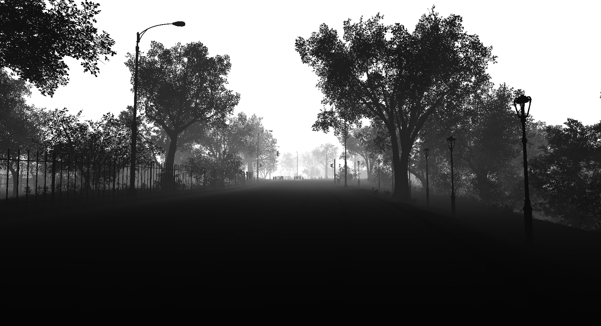

## 2025 Update: 
Project files may be out of date.

# Unreal Engine Synthetic Data Capture Tool

A lightweight Unreal Engine editor-only tool for capturing high-resolution screenshots and synthetic buffer visualizations such as custom stencil, depth, and base color using an in-editor actor.

---

## Features

- Editor-only synthetic image capture.
- High-resolution screenshot exporting via `CallInEditor` button.
- Supports custom buffer visualization modes (e.g., CustomStencil, BaseColor).
- Automatically configures screenshot pipeline for HDR-disabled output.
- Component-based scene region configuration.

---

## Usage

1. Add the `ASynCapture` actor to your level.
2. Align the `Camera` and `RenderRegion` to your desired capture area.
3. Click the `ExportRender` button in the Details panel (CallInEditor).
4. Captures are saved to your project’s `Saved` directory with date-based filenames.

---

## Class Reference

### `ASynCapture` Components:

- `RootComponent`: Scene root
- `RenderRegion`: Box volume to bound the region of interest
- `Camera`: Captures the scene

### Capture Logic:

- `ExportRender()`: Entry point for triggering synthetic data export.
- `CaptureSyntheticDataFrame()`: Uses high-res screenshot API and editor viewport to capture buffer visualizations.

---

## Capture Outputs

| Combined |
|----------|
|  |

| RGB | Segmentation |
|:---:|:------------:|
|  |  |

| Depth | World Normal |
|:-----:|:------------:|
|  |  |

---

## Editor Only

This actor is intended for editor use only. Do **not** deploy in packaged builds.

---

## Screenshot Configuration

Captures are done using `FHighResScreenshotConfig`. Adjust the Unreal Engine screenshot config if needed:
- HDR disabled
- Buffer targets dumped
- Date-based naming

---

## Notes

- The buffer visualization list (`RenderBuffers`) is currently commented out.
- Screenshot timing and multi-buffer capture logic can be extended via Ticker or buffer queue.

---
